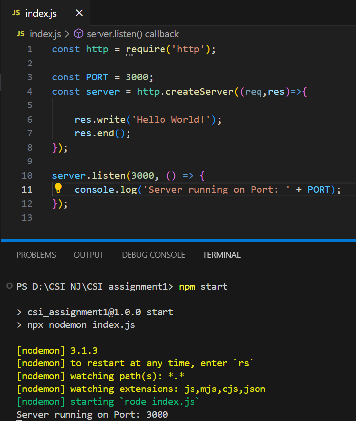
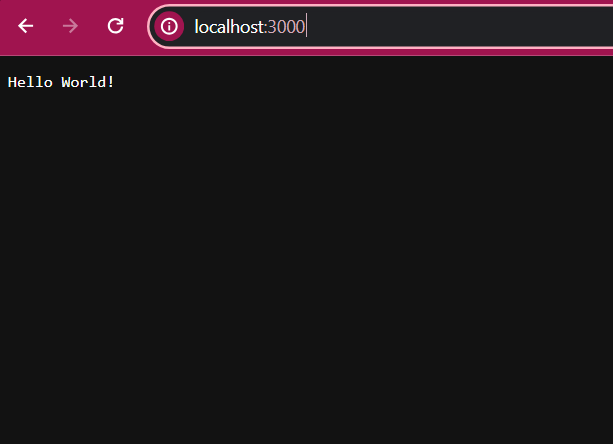

## CSI_1st_Assignment(NodeJs)
### "Hello World" application

- Download and Install NodeJs [referenceLink](https://nodejs.org/en/download/source-code)
- create a new folder and open it in your code editor
- run the following command on your terminal `npm init --y` to have a package.json file
- install *http* and necessary packages for your application by executing following command: `npm i <package_name>`
- create a file named *index.js* and write the code of your application
- write *start* script in package.json file as:
  - `"start": "node index.js"`
  - if you have nodemon installed: `"start": "npx nodemon index.js"`
- run your server by executing following command on terminal: `npm start`

